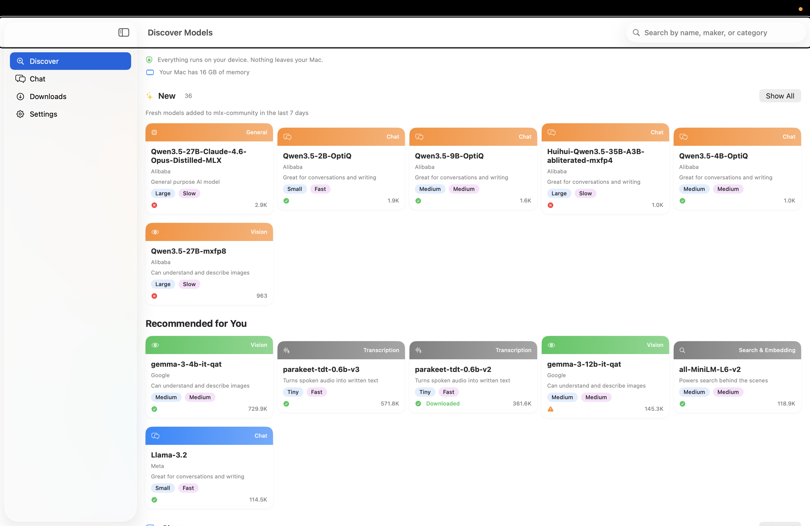
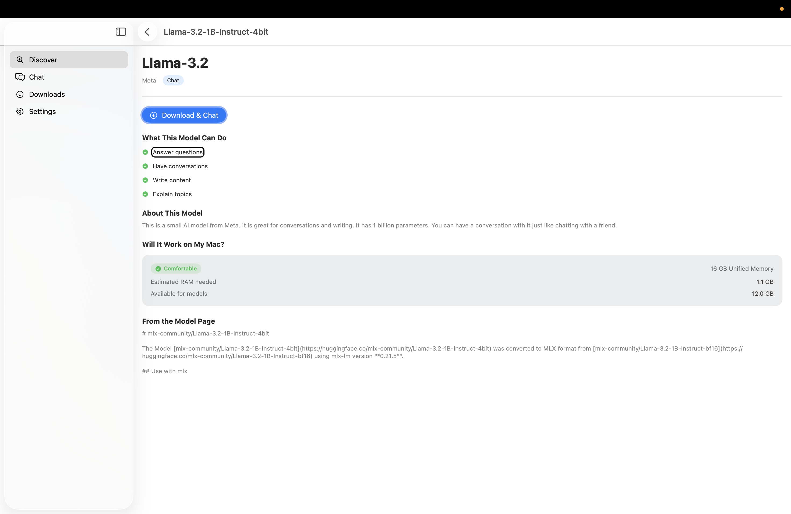
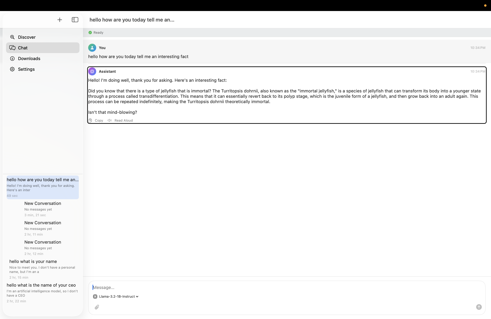
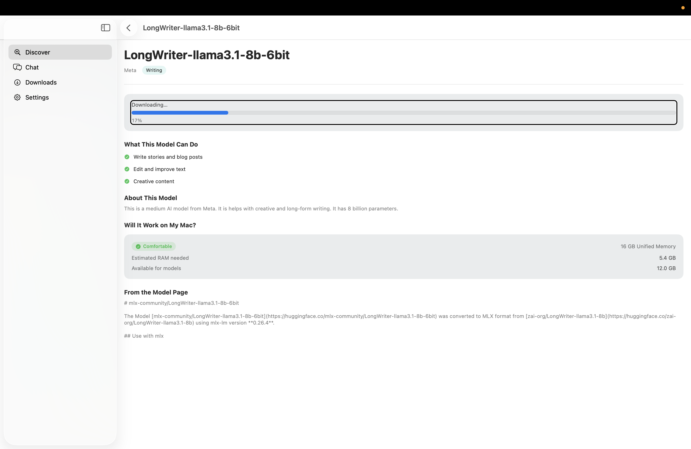
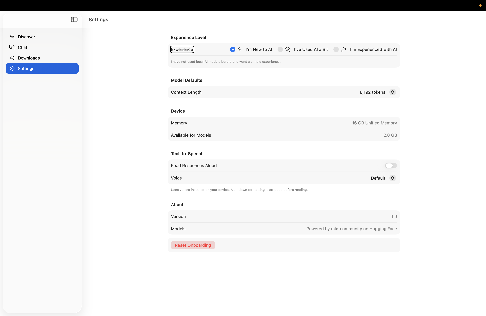

# Perspective Studio

Your LLM playground on Apple devices.

Perspective Studio is a free, open-source macOS app for running open-source AI models locally on your Mac. No cloud. No API keys. No subscriptions. Just you and the model, running on Apple Silicon.

Built with SwiftUI and [MLX Swift](https://github.com/ml-explore/mlx-swift-lm) by [Techopolis](https://github.com/Techopolis).

## See It in Action

https://github.com/Techopolis/Perspective-Studio/raw/main/screenshots/preview.mp4

| Discover Models | Model Details | Chat |
|---|---|---|
|  |  |  |

| Download Progress | Settings |
|---|---|
|  |  |

## Features

- Browse thousands of models from mlx-community on Hugging Face
- Download any model directly to your Mac with progress tracking
- Chat with models entirely on-device using MLX Swift
- See which models fit comfortably in your Mac's memory
- Text-to-speech playground with MLX Audio and VibeVoice
- Automatic conversation summarization to stay within context limits
- Beginner-friendly mode that hides technical jargon
- Fully accessible with VoiceOver and keyboard navigation

## Requirements

- macOS 26 or later
- Apple Silicon Mac (M1 or later)
- Xcode 26 (to build from source)

## Getting Started

1. Clone the repository:
   ```
   git clone https://github.com/Techopolis/Perspective-Studio.git
   ```
2. Open `perspective studio.xcodeproj` in Xcode
3. Build and run (Cmd+R)
4. Pick a model from the Discover tab and start chatting

## Built With

- [MLX Swift](https://github.com/ml-explore/mlx-swift)
- [MLX Swift LM](https://github.com/ml-explore/mlx-swift-lm)
- [Swift Transformers](https://github.com/huggingface/swift-transformers)
- [Hugging Face Hub](https://huggingface.co/mlx-community)

## Accessibility

Perspective Studio is fully accessible. VoiceOver, keyboard navigation, and screen reader support are built in from day one. If you find an accessibility issue, please report it using our [accessibility issue template](https://github.com/Techopolis/Perspective-Studio/issues/new?template=accessibility.yml).

## Contributing

Contributions are welcome. See [CONTRIBUTING.md](CONTRIBUTING.md) for guidelines.

All UI contributions must be tested with VoiceOver. This is not optional.

## License

MIT. See [LICENSE](LICENSE) for details.

## Related Projects

- [Perspective Server](https://github.com/Techopolis/Perspective-Server)
- [Perspective CLI](https://github.com/Techopolis/PerspectiveCLI)
- [Perspective Web](https://github.com/Techopolis/perspective-intelligence-web-community)
